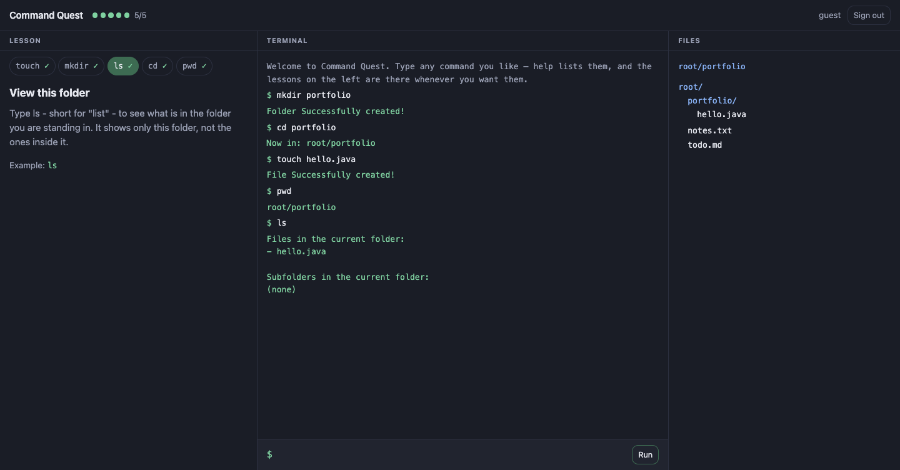

# Command Quest

[](https://github.com/zubairmuwwakil/command-quest/actions/workflows/ci.yml)
[](./LICENSE)
[](./pom.xml)

A small game that teaches command line basics — `touch`, `mkdir`, `ls`, `cd` —
by making you type them. It runs in a browser and in a terminal, from one
codebase.

**Live:** <https://commandquest.zubairmuwwakil.com>



The file tree on the right updates the instant a command succeeds. That is the
whole idea: a command line changes things you cannot see, and beginners lose the
thread because nothing visibly happens. Here it does.

## Running it

**Prerequisites:** JDK 25 and Python 3 (only to serve the static front end).
Maven is not needed — the wrapper downloads it.

**In a terminal**

```bash
./mvnw compile
java -cp target/classes ca.zubairm.command_quest.App
```

**As a web app**, in two terminals:

```bash
./mvnw spring-boot:run
```

```bash
cd docs && python3 -m http.server 5500
```

Then open <http://localhost:5500>. The page talks to `localhost:8080`
automatically when served from localhost; set `window.CQ_API` to point it
anywhere else.

## How it is put together

Three layers. The domain layer has no idea the web exists — `commands/` and
`hub/` import nothing from Spring.

```
BROWSER   docs/            static HTML, CSS, vanilla JS. No build step.
              │
              │  POST /api/command   { lessonId, command, path, state }
              │  ◀────────────────   { output, correct, hint, path, state }
              ▼
SERVER    web/             Spring Boot: controller, DTOs, validation, CORS
          commands/  hub/  the game itself — no Spring, no Scanner, no println
```

### The API keeps nothing

The server never remembers a player. Every request carries the whole folder tree
and the player's location; the server computes a result and forgets everything.

That is not purity for its own sake. It is what makes a free hosting plan
workable: containers on free plans sleep when idle and restart without warning,
and a server holding game state in memory would drop players mid-lesson every
time. Here a restart costs nothing, because the browser was holding the state
all along.

It also means `cd` cannot rely on server memory. Location travels as a list of
folder names — `["photos", "2024"]` — and the server rebuilds a `Navigator` by
walking the tree.

### One domain, two front ends

`Command.execute(Folder, String)` takes a typed line and returns a
`CommandResult`. It prints nothing and reads nothing:

```java
public interface Command {
    CommandResult execute(Folder folder, String input);
}
```

The console app and the browser are both just callers. Keeping the terminal
version working is the evidence that the abstraction is real rather than
decorative — if the domain had quietly grown web-shaped, the console app would
have broken first.

### `cd` is deliberately not a `Command`

`touch`, `mkdir`, and `ls` change *what is in a folder*. `cd` changes *which
folder you are looking at*. Widening the interface so all four matched would
hand every command a `Navigator`, giving `touch` the ability to move the player
— which it should never have. `CdCommand` keeps its own contract, and the web
layer adapts the two shapes into one dispatch table at the boundary.

Knowing where an abstraction does not fit is part of the design.

## Testing

```bash
./mvnw clean test
```

198 automated tests — 184 Java and 14 browser-side — none skipped. Java line
coverage is 95.7%; the report lands at `target/site/jacoco/index.html`.

The domain is tested without any Spring context, the web layer with `@WebMvcTest`
slices, and there is a round-trip test for the folder tree specifically — in a
stateless design a serialisation bug silently deletes a player's work instead of
throwing, so it is worth a test of its own.

`clean` is not decoration. Surefire runs whatever `*Test.class` it finds in
`target/test-classes`, including classes whose source has since moved, so a
plain `test` can report tests that no longer exist. CI asserts the skip count
is zero for the same reason: this suite once reported 103 tests while quietly
skipping 17 of them behind a green build.

## Deploying

See [DEPLOY.md](DEPLOY.md). The front end goes to GitHub Pages, the API to a
container host, and they are split so that a sleeping container never shows the
visitor a blank page.

## Built with

Java 25 · Spring Boot 4.1 · JUnit 6 · Maven · Docker · vanilla JS

## Repository layout

| Branch | |
|---|---|
| `main` | trunk — the console game, the web port, and what deploys |
| `individual-project` | the console version, frozen as submitted for coursework |

Tag `v1.0-submission` marks the coursework state.

## Status

Feature-complete and deployed, as of August 2026. Not under active development;
issues and pull requests are still read.

## License

MIT — see [LICENSE](LICENSE).
